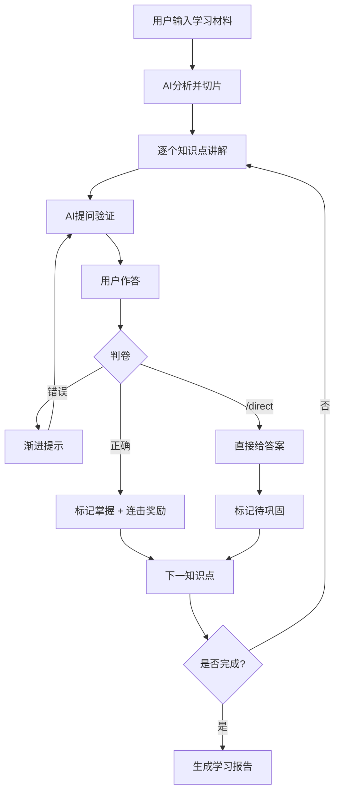

# Teacher-skill 产品需求文档

> **定位**：面向初级从业者的启发式数字助教，解决"理解幻觉"问题。

---

## 1. 目标用户与痛点

**目标用户**：
- 需要自学 AI/技术文档的初级从业者（产品/运营/研发转型人群）
- 经常阅读论文或技术资料，但难以理解与应用的读者

**核心痛点 —— "理解幻觉"**：
用户通过阅读 AI 生成的总结或解释，误以为自己已经掌握知识，但实际上：
- 无法复述核心概念
- 无法在真实场景中应用
- 短时间内遗忘内容

**解决方案**：将学习过程拆解为「讲解 → 提问 → 反馈」的闭环，通过限制直接给答案，引导用户参与思考过程。

---

## 2. 核心机制

### 2.1 教学闭环

```
AI讲解知识点 → AI提问 → 用户作答 → 判卷
  ├─ 正确 → 标记掌握 → 下一知识点
  ├─ 错误 → 渐进式提示(hint_level 1-4) → 重新作答
  └─ /direct → 速查模式 → 标记待巩固 → 下一知识点
```

### 2.2 双模式设计

| 模式 | 规则 | 适用场景 |
|------|------|---------|
| **学习模式（默认）** | 答错禁止直接给答案，必须依次提供线索提示→生活类比→半解析 | 深度学习与知识内化 |
| **速查模式（/direct）** | 直接输出详细解析，但该知识点标记为 `needs_review` | 时间紧迫或任务导向 |

### 2.3 渐进式提示

| hint_level | 内容 | 场景 |
|-----------|------|------|
| 1 | 线索提示 | 第一次答错 |
| 2 | 生活类比 | 第二次答错 |
| 3 | 半解析 | 第三次答错 |
| 4+ | 部分答案 | 多次答错后自动推进 |

---

## 3. 用户体验流程



---

## 4. 核心验证指标

| 指标 | 目标值 | 说明 |
|------|--------|------|
| 学习流程完成率 | > 60% | 用户从开始到完成整个主题的比例 |
| `/direct` 使用占比 | < 40% | 速查模式使用过多说明引导太烦 |
| 用户复访率 | 待定义 | 用户是否愿意再次使用 |

---

## 5. MVP 边界（Phase 1 已确定）

**本阶段包含**：
- 纯文本教学交互闭环
- 用户水平摸底（beginner/intermediate/advanced）
- 知识切片（3-7 个 chunk）
- 渐进式提示（hint_level 1-4）
- 速查模式（`/direct`）
- 进度持久化与恢复

**本阶段不做**：
- 复杂文档解析（PDF/图片等）→ **Phase 2 纳入**
- 长期多端账户记忆
- 多模态交互（语音/图像）
- Skill 保存/分享 → **Phase 3 纳入**
